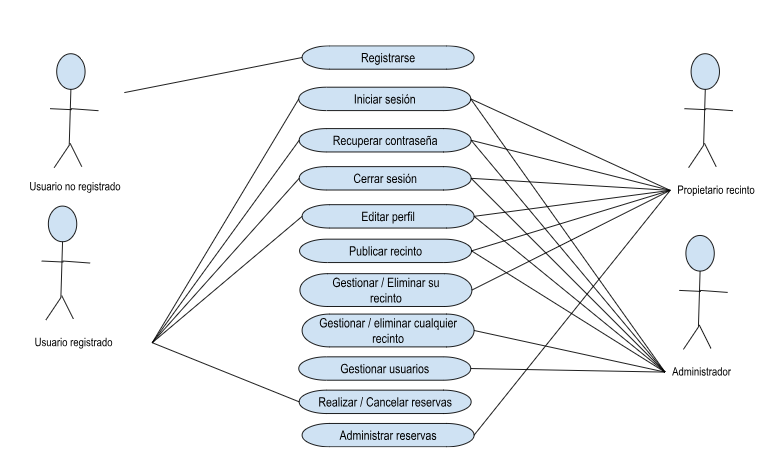

# Documentacion SRED
# Requisitos y diagrama de casos de uso
En la introducción de esta documentación, en la sección El proyecto SRED, en concreto en el apartado Requisitos del proyecto y casos de uso general, hemos definido qué se espera de nuestra aplicación web, a partir de los 'Casos de uso general'.

También hemos dividido todo el trabajo de desarrollo en diferentes versiones, con la intención de que nuestro proyecto esté operativo desde el inicio de su implementación, de manera que conforme evolucione a posteriores versiones, aumentaremos su nivel de funcionalidad.

Por lo tanto, vamos a comenzar por la versión 1.0.

Lo primero es definir los casos de uso para esta versión. Una primera aproximación podría ser la siguiente:

# Casos de uso para la V1.0
Registrar usuario: Un usuario puede registrarse en la plataforma proporcionando su nombre, apellidos, email y contraseña. 
Iniciar sesión: Un usuario registrado puede iniciar sesión en la plataforma proporcionando su email y contraseña. 
Cerrar sesión: Un usuario puede cerrar su sesión en la plataforma en cualquier momento. 
Editar perfil: Un usuario registrado puede editar su perfil, actualizando su nombre, apellidos, email o contraseña. 
Ver instalaciones: Un usuario registrado puede ver un listado de instalaciones publicadas por los propietarios. 
Publicar instalación: Un usuario con el perfil de propietario puede publicar una instalación y sus horarios proporcionando información como nombre, descripción, imagen representativa, horarios, capacidad, etc. 
Editar instalación: Un usuario con el perfil de propietario puede editar una instalación que haya publicado previamente, actualizando su información. 
Eliminar instalación: Un usuario con el perfil de propietario puede eliminar una instalación que haya publicado previamente. Ver/Editar usuarios: Un administrador puede ver una tabla con todos los usuarios que hay registrados y editar la información, incluido el ROL de usuario. 
Eliminar usuario: Un administrador puede eliminar cualquier usuario registrado en la plataforma.

# Diagrama de casos de uso 
Para tener la información de manera gráfica vamos a utilizar uno de los diagramas UML que aprendimos a hacer el curso pasado: Qué es un diagrama UML? UML, que significa Lenguaje de Modelado Unificado (Unified Modeling Language, en inglés), es un lenguaje estándar utilizado en el desarrollo de software para visualizar, especificar, construir y documentar los artefactos de un sistema. Los diagramas UML son representaciones gráficas utilizadas en UML para modelar diferentes aspectos del sistema.

Existen varios tipos de diagramas UML, cada uno de los cuales se enfoca en un aspecto específico del sistema y proporciona diferentes niveles de detalle. Algunos de los diagramas UML más comunes son:

Diagrama de casos de uso: describe las interacciones entre los actores y el sistema, mostrando qué funcionalidades proporciona el sistema a los usuarios.

Diagrama de clases: representa la estructura estática del sistema, mostrando las clases, sus atributos, métodos y las relaciones entre ellas.

Diagrama de secuencia: muestra la interacción entre los objetos en una secuencia temporal, describiendo cómo los objetos se comunican y colaboran entre sí.

Diagrama de actividades: describe el flujo de trabajo o los procesos empresariales en un sistema, mostrando las actividades y las decisiones que se toman en cada etapa.

Diagrama de componentes: muestra la estructura de componentes de un sistema, identificando los componentes y las dependencias entre ellos.

Diagrama de despliegue: representa la arquitectura física del sistema, mostrando cómo los componentes se distribuyen en el hardware y la red.

Estos son solo algunos ejemplos de los diagramas UML más utilizados, pero hay otros diagramas, como el diagrama de estados, el diagrama de objetos y el diagrama de comunicación, que también se utilizan para modelar diferentes aspectos de un sistema. En general, los diagramas UML proporcionan una representación visual clara y sistemática del sistema, lo que facilita la comprensión, la comunicación y el diseño del software.

¿Qué es un diagrama de casos de uso? Un diagrama de casos de uso es una herramienta utilizada en el análisis y diseño de sistemas de software para representar las interacciones entre los actores (usuarios o sistemas externos) y el sistema en sí. Es una representación visual que describe cómo se utilizará el sistema desde la perspectiva del usuario.

En un diagrama de casos de uso, los actores se representan mediante figuras externas al sistema, como personas, otros sistemas o incluso dispositivos. Los casos de uso, por otro lado, se representan como elipses y describen las diferentes acciones o funciones que el sistema proporciona a los actores.

El diagrama muestra las relaciones entre los actores y los casos de uso a través de líneas que conectan las figuras correspondientes. Estas líneas representan las interacciones entre los actores y el sistema, indicando qué casos de uso son accesibles para cada actor.

Los casos de uso se utilizan para capturar los requisitos funcionales del sistema y proporcionar una visión general de cómo interactúan los diferentes actores con el sistema. También ayudan a identificar los distintos escenarios de uso y las relaciones entre ellos.

El diagrama de casos de uso es una herramienta valiosa para comunicar y comprender las funcionalidades clave del sistema entre los desarrolladores, los usuarios y otros interesados en el proyecto de software.

El diagrama de casos de uso para la versión 1.0 sería el siguiente:

Este diagrama refleja de forma resumida qué acciones se pueden llevar a cabo en nuestro aplicación dependiendo del rol del usuario.

Ahora que tenemos claro todo lo que debe hacer la versión 1.0, nuestra misión ahora es planificar el trabajo que se nos viene encima...

# PLANIFICACIÓN DEL PROYECTO
## Planificación del proyecto

¡Estamos listos y hemos comenzado a desarrollar la versión 1.0 de nuestro proyecto!

En el apartado anterior hemos definido qué funcionalidades debe tener. Además, hemos analizado las diferentes arquitecturas y tecnologías y hemos optado por utilizar una CSR (Client Side Rendering basada en una SPA programada en Javascript y conectada a Supabase como servicio backend).

Por lo tanto estamos en condiciones de definir cada una de las tareas que necesitaremos realizar para llevar a cabo esta primera versión del proyecto.

Para poder planificar el trabajo, vamos a crear el 'backlog de proyecto', es decir, vamos a desglosar el trabajo en historias para, a continuación, crear el backlog de sprint (donde agruparemos las historias por entregas). Finalmente vamos a planificar su temporización, es decir, vamos a asignar un tiempo determinado a cada historia.
¿Qué es el backlog de producto?
El Backlog de producto (Product Backlog en inglés) es una herramienta clave en la metodología Scrum, utilizada para gestionar el trabajo a realizar en un proyecto de software o desarrollo de producto.

El backlog de producto es una lista ordenada de todas las funcionalidades, características, requisitos y mejoras que deben ser desarrollados en el producto para cumplir con los objetivos del proyecto.

El backlog de producto es creado por el Product Owner (dueño del producto) en colaboración con el equipo de desarrollo. El Product Owner es responsable de priorizar el backlog de producto y asegurar que las funcionalidades más importantes y valiosas sean entregadas primero. El equipo de desarrollo utiliza el backlog de producto para planificar y estimar el trabajo a realizar en cada iteración (sprint) del proyecto.

El backlog de producto es una herramienta valiosa para el desarrollo ágil de software, ya que ayuda a mantener el enfoque en el valor que se está entregando al usuario final, asegura que el equipo de desarrollo esté trabajando en las funcionalidades más importantes y permite una planificación más precisa de las iteraciones del proyecto.

## Backlog de producto y de sprint.
Estas serían las historias a planificar en la entrega de la versión 1 de nuestro proyecto agrupadas por sprints:

### SPRINT 0: Definición del proyecto
Historia: Requisitos, casos de uso y diagrama de casos de uso Como desarrollador, quiero definir de manera genérica las especificaciones de la aplicación.

Historia: Versiones y planificación Como desarrollador, quiero agrupar las especificaciones en versiones, definir las tareas necesarias y realizar la planificación de todo el proceso de desarrollo del proyecto.

Historia: Casos de uso especificos y diagramas de flujo Como desarrollador quiero definir las especificaciones y casos de uso para la versión 1.0.

(Esta historia ya hemos comenzado a trabajarla en apartados anteriores. No obstante, es importante que quede constancia de ello para poder hacer una valoración del tiempo total invertido.)

### SPRINT 1: Diseño de la interficie
Historia: Bocetos: Como diseñador quiero dibujar los bocetos de todas las posibles pantallas del proyecto y testear su funcionamiento.
Historia: Wireframes, Mockup y guía de estilos: Como diseñador quiero dibujar los mockups y crear la guía de estilos a partir de los colores, tipografías, etc seleccionadas.
### SPRINT 2: Prototipos
Historia: Entorno de desarrollo: Como diseñador/programador quiero instalar y configurar las herramientas necesarias para programar la aplicación, trabajar con repositorios y crear un entorno integración continua y despliegue continuo.
Historia: Prototipos html: Como maquetador web quiero crear las páginas html del proyecto a partir de los wireframes aplicando la guía de estilos y utilizando Bootstrap 5.
Historia: Validaciones de formularios: Como programador quiero definir e implementar las validaciones de los formularios del proyecto
### Sprint 3: Implementación de la SPA
Historia: Entorno de desarrollo basado en NodeJS: Como programador quiero instalar y configurar todas las herramientas necesarias (NodeJS, Vite, etc.) para el desarrollo de una app tipo SPA basada en Javascript
Historia: Creación de proyecto basado en SPA y organización de archivos para las vistas basadas en módulos js: Como programador quiero configurar el sistema de carpetas para las vistas y crear los archivos a partir de componentes html basados en los prototipos.
Historia: Creación de componentes: Como programador quiero crear los componentes para el encabezado, el enrutado de las páginas y los menús.
Historia: Diseño del aspecto de las vistas: Como usuario quiero poder navegar por todas las vistas de la aplicación (independientemente del del rol).
Historia: Implementación de la lógica para la validación de los formularios: Como usuario quiero recibir feedback de validación en las vistas con formularios.
Historia: Lógica para la autenticación de usuarios: Como usuario registrado quiero poder recordar los datos de sesión al loguearme (Uso de localStorage)
Historia: Actualización de componentes header y menús en función del rol de usuario logueado: Como usuario logueado quiero poder navegar por las vistas de la aplicación. (Podrán verse solo las opciones que corresponden a mi rol).
Historia: Diseño de las vistas a partir de los datos de un archivo JSON: Como programador quiero simular el registro, login y visualización de las tablas de usuarios y proyectos a partir de datos ficticios obtenidos de una archivo json de prueba.
Historia: Lógica para la administración de usuarios y proyectos (ver, editar, borrar, etc.): Como administrador quiero poder gestionar los usuarios y proyectos (CRUD)
### Sprint 4: Backend
Historia: Diseño de la base de datos: Como programador quiero diseñar la base de datos en base a diagrama UML (diagrama entidad-relación)

Historia: Implementación de las tablas y funciones en supabase: Como programador quiero implementar las bases de datos en Supabase, diseñar las consultas e implementar las funciones postgree multitabla

Historia: API javascript de Supabase: Como programador quiero probar las apis de javascript para el acceso a la base de datos

Historia: Implementación de un ORM para mapping de la base de datos: Como programador quiero diseñar el diagrama de clases e implementarlo en javascript para tener un mapping de la bd.

### Sprint 5: Integración del frontend y el backend
Historia: Login y registro: Como usuario quiero poder registrarme e iniciar sesión.

Historia: Gestión de sesiones: Como usuario registrado quiero ver la web en base al rol que tengo asignado.

Historia: Editar perfil Como usuario registrado quiero poder ver y modificar mi perfil.

Historia: Gestión de Proyectos (Vista proyectos, detalle proyecto, etc): Como usuario registrado 'desarrollador' quiero poder ver los proyectos, ver mis proyectos, crear proyectos, ver detalle de los proyectos y editar y borrar mis proyectos.

Historia: Gestión de usuarios: Como usuario registrado 'administrador' quiero poder ver, editar y borrar los usuarios del sistema.

### Sprint 6: Revisión y despliegue en producción de la versión 1.0
Historia: Test de usuarios Como diseñador quiero realizar tests de usuarios a un grupo de usuarios focales.

Historia: Revisión de la aplicación Como programador quiero revisar y corregir los posibles problemas detectados en el test de usuarios.

Historia: Despliegue en producción Como programador quiero despleguar la aplicación en producción.

Ahora que tenemos las historias definidas es el momento de planificar el trabajo. Para ello necesitamos una herramienta que nos permita gestionar y temporizar cada una de las tareas. Nosotros utilizaremos GitHub Projects
